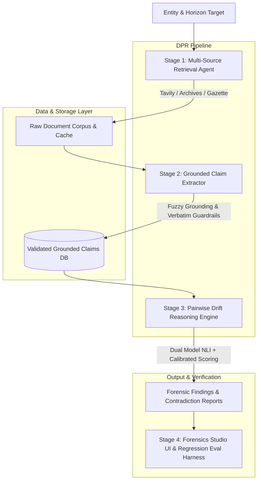

<div align="center">

# autopsy.ai 🔍
### Autonomous Policy & Statement Drift Forensics Engine

[](https://python.org)
[](https://fastapi.tiangolo.com)
[](https://nextjs.org)
[](https://www.typescriptlang.org/)
[](https://tailwindcss.com)
[](https://opensource.org/licenses/MIT)

<p align="center">
  <b>Detecting silent policy reversals, unacknowledged rule changes, and commitment drift across public institutions and enterprises.</b>
</p>

[Architecture](#architecture--dpr-v20-pipeline) •
[Features](#key-features) •
[Quickstart](#getting-started) •
[Evaluation Harness](#evaluation-harness--benchmarks) •
[API Reference](#api-reference)

</div>

---

## 📖 Overview

**autopsy.ai** is an autonomous policy forensics engine designed to hold public institutions, government bodies, and corporations accountable to their dated historical commitments. 

Unlike generic summarization tools, **autopsy.ai**:
1. Ingests dated public statements, press releases, gazette notices, and web archives across multi-year horizons.
2. Extracts structured factual claims backed by **strict verbatim-excerpt grounding guardrails** (hallucinated or ungrounded claims are rejected).
3. Executes **pairwise Natural Language Inference (NLI)** to classify temporal drift into distinct forensic categories:
   - 🔄 **`explicit_update`**: Disclosed modifications with transparent acknowledgment.
   - ⚠️ **`silent_contradiction`**: Unannounced reversals or stealth rollbacks.
   - ✅ **`consistent`**: Semantic stability and reaffirmation over time.
   - ❓ **`insufficient_evidence`**: Inconclusive or ambiguous historical records.
4. Generates an interactive, audit-ready forensics timeline complete with contradiction severity scores, evidence diversity calibration, and auditor review queues.

---

## 🏗️ Architecture & DPR v2.0 Pipeline

The **Deep Policy Reasoning (DPR v2.0)** pipeline operates across four decoupled forensic stages:



### Stage Details:
1. **Stage 1 — Multi-Source Retrieval Agent (`backend/engine/retrieval_agent.py`):**
   - Dispatches parallel queries across Tavily Search, official press releases, government archives, and cached snapshots.
   - Deduplicates and normalizes document metadata, publishing dates, and canonical sources.

2. **Stage 2 — Grounded Extractor Engine (`backend/engine/extractor_engine.py`):**
   - High-throughput LLM extraction (`gemini-3.5-flash-lite` / `gpt-4o-mini`) enforcing strict token-level verbatim excerpt validation.
   - Any claim lacking a fuzzy or exact substring match in the raw source text is rejected before persistence.

3. **Stage 3 — Drift Reasoning Engine (`backend/engine/drift_reasoning_engine.py`):**
   - Performs pairwise baseline & adjacent temporal evaluations across extracted claims.
   - Calibrates contradiction severity based on evidence diversity ($W_1$), skeptic resistance ($W_3$), and timezone skew uncertainty ($W_4$).

4. **Stage 4 — Human-in-the-Loop & Evaluation Harness (`backend/eval/eval_harness.py`):**
   - Continuous regression testing against a ground-truth benchmark suite of 20+ real-world policy shifts.
   - Auditor verification queue for human forensic sign-off.

---

## ✨ Key Features

- **🛡️ Strict Verbatim Grounding Guardrails**: Zero hallucination tolerance. Every claim is cross-verified against the raw crawled source text.
- **⚡ Dual-Engine Reasoning**: Decoupled high-speed extraction from deep natural language inference reasoning for cost and latency optimization.
- **📊 Progressive Disclosure Studio**: Interactive Next.js workspace with entity selectors, contradiction diff visualizers, claim comparison cards, and corpus freshness managers.
- **🧪 Automated CI/CD Regression Gate**: Built-in evaluation harness measuring Precision, Recall, F1, and Grounding Fidelity before deployment.
- **🔌 Multi-Database Flexibility**: Zero-config SQLite support with automated SQLite-FTS fallback, plus enterprise PostgreSQL connection pooling.
- **📡 Real-Time WebSocket Streaming**: Live investigation progress broadcaster showing crawling, extraction, and pairwise evaluation as they execute.

---

## 🗂️ Repository Structure

```
autopsy.ai/
├── backend/
│   ├── api/
│   │   ├── main.py                  # FastAPI REST API & WebSocket Gateway
│   │   ├── database.py              # SQLAlchemy PostgreSQL / Session connection
│   │   ├── models.py                # Database models & ORM schemas
│   │   └── websocket_manager.py     # Live investigation broadcast manager
│   ├── core/
│   │   ├── config.py                # System configuration & environment loader
│   │   ├── db.py                    # SQLite persistence & query abstraction
│   │   ├── llm_client.py            # Multi-provider LLM connector (Gemini / OpenRouter / OpenAI)
│   │   └── models.py                # Pydantic schemas, Enums, & Data validation
│   ├── engine/
│   │   ├── retrieval_agent.py       # Multi-source live search & corpus engine
│   │   ├── extractor_engine.py      # Grounded claim extractor with verification
│   │   ├── drift_reasoning_engine.py# Pairwise semantic drift classifier & scoring
│   │   └── wikipedia_agent.py       # Entity context & historical baseline retrieval
│   ├── eval/
│   │   ├── eval_cases_seed.py       # 21 hand-labeled ground-truth policy cases
│   │   ├── eval_harness.py          # Regression benchmark runner & accuracy scorer
│   │   └── test_*.py                # Scheme-specific regression test suites
│   ├── scripts/
│   │   └── init_postgres.py         # PostgreSQL schema initializer & migration script
│   ├── requirements.txt             # Python dependencies
│   ├── run_server.py                # Uvicorn backend launcher
│   └── .env.example                 # Backend environment variable template
├── frontend/
│   ├── app/
│   │   ├── layout.tsx               # Root layout, fonts, and dark mode script
│   │   ├── page.tsx                 # Main Forensic Investigation Workspace
│   │   ├── globals.css              # Custom Tailwind styling & design tokens
│   │   └── login/                   # User authentication & onboarding portal
│   ├── components/
│   │   ├── InvestigationWorkspace.tsx  # Entity selector & dense comparison table
│   │   ├── ClaimComparisonCard.tsx     # Progressive disclosure contradiction card
│   │   ├── AdminCorpusManager.tsx      # Corpus freshness tracker & failure logs
│   │   ├── EvalDashboard.tsx           # Evaluation harness & regression tracker
│   │   ├── HeaderTelemetry.tsx         # Navigation & system status telemetry
│   │   ├── PolicyFindingCard.tsx       # Detailed policy drift report cards
│   │   └── ThemeToggle.tsx             # Dark/Light mode switcher
│   ├── package.json                 # Next.js & UI dependencies
│   ├── tailwind.config.js           # Tailored typography and color palettes
│   └── tsconfig.json                # TypeScript compiler configuration
├── .gitignore                       # Production gitignore rules
├── .env.example                     # Root environment variable template
└── README.md                        # Master documentation
```

---

## 🚀 Getting Started

### Prerequisites

Ensure you have the following installed:
- **Python 3.10+**
- **Node.js 18.0+** and **npm** / **yarn** / **pnpm**
- *(Optional)* **PostgreSQL 14+** (SQLite is enabled by default with zero configuration required)

---

### 1. Clone & Configure Environment

```bash
# Clone the repository
git clone https://github.com/<your-username>/Autopsy.ai.git
cd Autopsy.ai

# Create backend environment file
cp .env.example backend/.env
```

Edit `backend/.env` with your API credentials:
```env
# Required for extraction & reasoning
GEMINI_API_KEY="your_gemini_api_key"
OPENROUTER_API_KEY="your_openrouter_key"   # Or OPENAI_API_KEY

# Required for live policy retrieval
TAVILY_API_KEY="your_tavily_api_key"
```

---

### 2. Setup & Run Backend

```bash
# Navigate to backend directory
cd backend

# Create and activate virtual environment
python -m venv venv
# On Windows:
.\venv\Scripts\activate
# On macOS/Linux:
source venv/bin/activate

# Install dependencies
pip install -r requirements.txt

# Start the FastAPI Server (Port 8008)
python run_server.py
```
> The backend API will be live at `http://127.0.0.1:8008` with interactive Swagger docs at `http://127.0.0.1:8008/docs`.

---

### 3. Setup & Run Frontend

Open a new terminal window:

```bash
# Navigate to frontend directory
cd frontend

# Install Node dependencies
npm install

# Start Next.js Development Server (Port 3000)
npm run dev
```
> The Forensic Investigation Studio will be accessible at `http://localhost:3000`.

---

## 🧪 Evaluation Harness & Benchmarks

To ensure high precision and protect against drift regression, run the built-in benchmark harness:

```bash
# From backend directory
python -m eval.eval_harness
```

The harness evaluates against 21 curated ground-truth cases (e.g. *Ayushman Bharat coverage expansions*, *MGNREGA wage policy revisions*, *Tech subscription terms changes*) and reports:
- **Drift Classification Accuracy & F1 Score**
- **Grounding Fidelity Rate** (% of claims with verified source attribution)
- **False Alarm (Hallucinated Contradiction) Rate**

---

## 📡 API Reference

### Core Endpoints

| Method | Endpoint | Description |
| :--- | :--- | :--- |
| `GET` | `/api/health` | System health check and model connectivity status |
| `GET` | `/api/entities` | List tracked entities and policy corpora |
| `POST` | `/api/investigate` | Trigger end-to-end multi-source investigation |
| `GET` | `/api/findings/{entity_id}` | Retrieve pairwise drift findings & severity scores |
| `POST` | `/api/eval/run` | Trigger evaluation benchmark run |
| `WS` | `/ws/investigate/{session_id}` | Live investigation WebSocket stream |

---

## 🔒 Security & Privacy

- **No Secrets in Source**: All API keys and secrets are loaded via environment variables and excluded via `.gitignore`.
- **Grounded Verification**: All LLM inferences are cross-checked against source texts before persistence to avoid misinformation.
- **Audit Logs**: All manual auditor corrections are recorded with timestamps.

---

## 📄 License

This project is licensed under the MIT License — see the [LICENSE](LICENSE) file for details.
